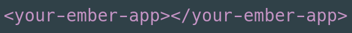

<p align="center">
  
</p>

ember-web-component-container
==============================================================================

This addon exposes your Ember app as a standard WebComponent,
which makes it much easier to integrate in existing applications.

Compatibility
------------------------------------------------------------------------------

* Ember.js v3.4 or above
* Ember CLI v2.13 or above
* Node.js v8 or above


Installation
------------------------------------------------------------------------------

```
ember install ember-web-component-container
```


Usage
------------------------------------------------------------------------------

Once the addon is installed, you can remove the `<link>` tags fron your `index.html`.

The CustomElement that is created is the dasherised version of the application name:
If your app is `my-devilish-venture`, add `<my-devilish-venture></my-devilish-venture>`
to your `index.html` to start the app.

**note**: CustomElement MUST be dasherized names. In case your application
is single-worded (as in "mononoke"), the addon will expose
`mononoke-app` (Note the `-app` prefix) for compliance.

**note**: We aso recommend that you remove the addon `export-application-global`.
The application itself is accessible from the Custom Element itself as follows:
`document.querySelector("my-devilish-venture").__EMBER_APPLICATION`

Contributing
------------------------------------------------------------------------------

See the [Contributing](CONTRIBUTING.md) guide for details.

### TODO

*    Deal with attributes and slots
*    JS isolation


License
------------------------------------------------------------------------------

This project is licensed under the [MIT License](LICENSE.md).
